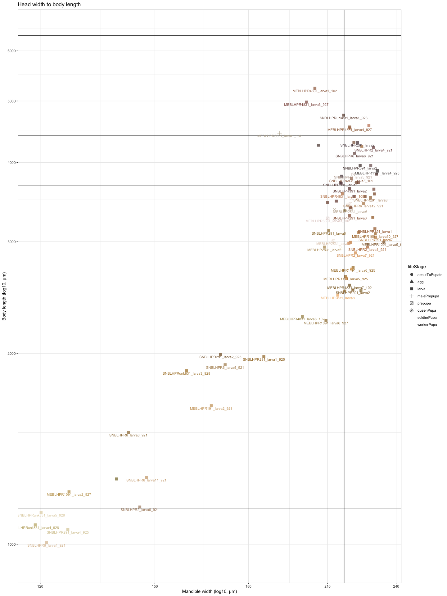

Cephalotes varians larval allometry data
================
Megan Barkdull

## Mandible width to body length:

This plot present larval mandible width vs. body length, with key
benchmarks noted:

    ## [1] "Soldier pupa mean body length is 4415.2576 uM"

    ## [1] "Worker pupa mean body length is 3670.21975862069 uM"

    ## [1] "Queen pupa mean body length is 6338.89 uM"

    ## [1] "Male pupa mean body length is NaN uM"

    ## [1] "The mean prepupal head width is 217.518666666667 uM"

<!-- -->
