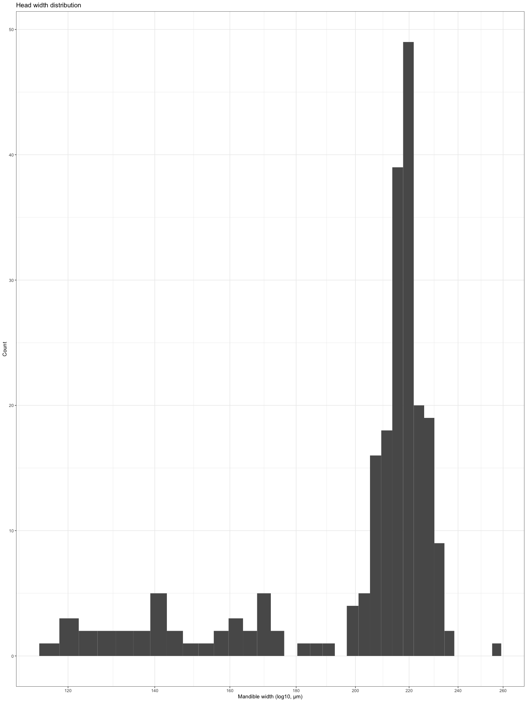

Cephalotes varians larval allometry data
================
Megan Barkdull

## Mandible width to body length:

This plot present larval mandible width vs. body length, with key
benchmarks
    noted:

    ## [1] "Soldier pupa mean body length is 4415.2576 uM"

    ## [1] "The halfpoint between soldier and worker body length is 4010.00369344262 uM"

    ## [1] "Worker pupa mean body length is 3604.74978688525 uM"

    ## [1] "Queen pupa mean body length is 6393.8965 uM"

    ## [1] "Male pupa mean body length is 4647.183 uM"

    ## [1] "The mean prepupal head width is 217.772821428571 uM"

<!-- -->

Note that three larvae from MEBLHPR4831 are currently developing into
queens, and were measured on 9/27, 10/02, 10/13, and 10/25, by which
point one of them had pupated and I froze all three.

<!-- -->
